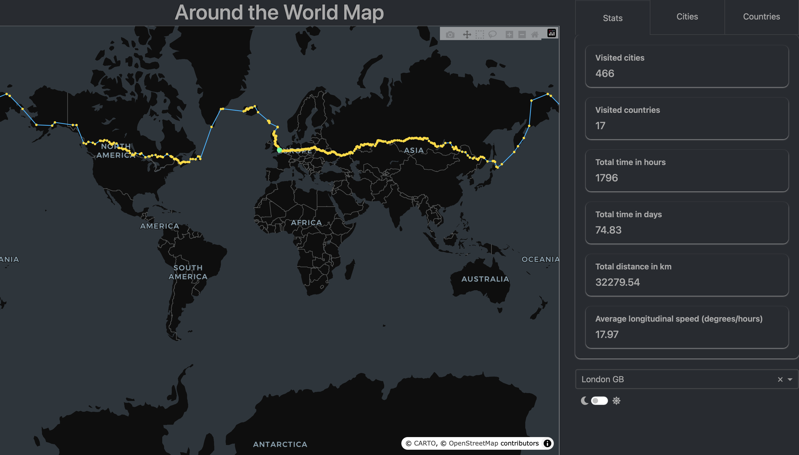

# Around the World

This project implements an interactive simulation of an eastward journey around the world using real city-level geographic data. Starting from a selected city, the algorithm chooses the next destination based on angular distance, population and proximity rules, ultimately returning to the origin. A Dash web interface visualizes the computed route, statistics and visited locations through a clean, theme-aware layout.

---

## Overview

The application is structured as a modular Dash project:

- **Route simulation**  
  Implemented in `main.py`, the `move_atw` function computes the complete trip by iteratively selecting the next city using neighbor-search functions from `utils.py`.  
  Cities are chosen based on geographic constraints and travel-time heuristics, ensuring consistent eastward movement until the path loops back to the origin.

- **Data processing**  
  `import_data.py` loads and preprocesses a global city dataset, merging it with ISO country information and standardizing key fields for routing and display.

- **Visualization**  
  `map_creator.py` generates the interactive map using Plotly, drawing each step of the route with theme-based coloring and highlighting the starting point.

- **Statistics and summaries**  
  `stats.py` computes aggregated metrics such as total time, total distance, visited cities, visited countries and average speed.  
  It also renders two lists:  
  - Cities visited with population ≥ 200,000  
  - Countries visited during the trip

- **User interface**  
  `app_render.py` defines the main page layout, including the map, statistics panel, lists and a city selector.  
  A built-in theme switch (YETI / SLATE via Dash Bootstrap Templates) allows transition between light and dark modes.

- **Styling**  
  Custom CSS in `style.css` provides layout structure, spacing, grid organization and component styling consistent with the overall visual design.

---

## Screenshot


---

## Project Structure

```
around_the_world/
│
├── app_render.py          # Main Dash layout, UI structure and theme switch
├── main.py                # Core routing algorithm (move_atw) generating the full trip
├── map_creator.py         # Plotly map construction and theme-aware rendering
├── stats.py               # Trip statistics computation and dynamic list generation
├── import_data.py         # Loading and preprocessing of world city datasets
├── utils.py               # Geographic calculations and city-selection functions
├── ids.py                 # Centralized constants 
├── requirements.txt       # Python dependencies for running the app
│
├── assets/                # Static files automatically served by Dash
│   └── style.css          # Custom CSS for layout, cards, lists and theme consistency
│
└── docs/
    └── screenshot.png     # Application screenshot included in the README
```

---

## License

This project is released under the **GNU General Public License v3.0 (GPL-3.0)**.
